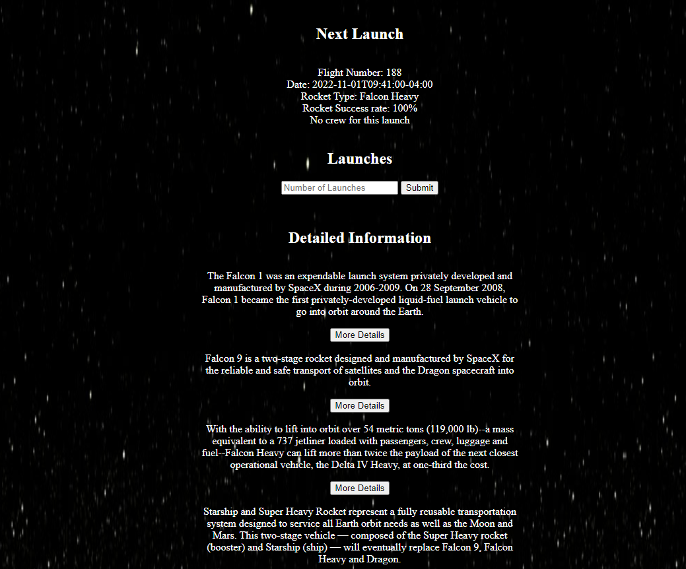

# CSS Hell

Welcome to an assignment I took too far. The goal of the assignement was to implement the SpaceX API for rocket launches. There is a button at the top of the
bottom of the screen that enables the crazy CSS. It was just a test, but needs to be shared to the world.

## Main Page

## CSS Hell
